A continuación, se da una breve explicación de la API RESTful realizada para el ejercicio 1.

# Clases
Se crearón 7 clases para realizar un mejor manejo de los datos que se enviaban y recibian en la API:
1. User : Guarda los datos del ususario
2. Adress: Guarda la dirección del usuario
3. Geo: Guarda la altitud y latitud de la dirección del usuario
4. Company: Guarda la compañia del usuario
5. Publication: Guarda la publicacion realizada por el usuario y sus respectivos comentarios
6. Comment: Guarda los comentarios de una publicación
7. Todo: Guarda las tareas del usuario.

En la siguiente imagen podemos ver el diagrama de clases correspondiente.

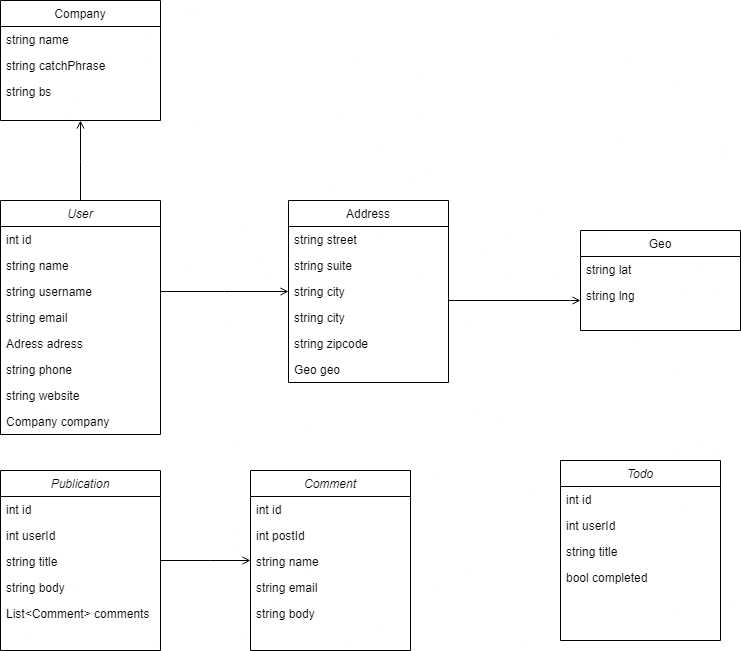

# API
Para la realización de la API se utilizo el framework  ASP.NET WebAPI y se realizarón las pruebas para verificar la funcionalidad de la API con Swagger y con POSTMAN. Se realizaron 4 funciones que realizan peticiones GET y 1 función que realiza una petición POST, dentro de estas funciones se realizan las peticiones a la API de JSONPlaceholder para obtener los datos, se estructurán estos datos dependiendo de la clase a la que pertenezcan y se regresan como respuesta. A continuación se listan las funciones:
1. funcion GetUsers(): Nos ayuda a obtener todos los usuarios que nos proporciona la API JSONPlaceholder. Su endpoint es: /users
2. funcion GetUser(int id): Nos ayuda a obtener el usuario correspondiente con el id proporcionado por la API JSONPlaceholder. Su endpoint es: /users/id
3. funcion GetPost(int id): Nos ayuda a obtener los post del usuario correspondiente con el id y sus respectivos comentarios. Su endpoint es: /users/id/post
4. funcion GetTodo(int id): Nos ayuda a obtener las tareas del usuario correspondiente con el id. Su endpoint es: /users/id/todos
4. funcion PostTodo(int idUser,string title,bool completed): Realiza la insersión mediante una solicitud POST a la API de JSONPlaceholder y regresa el id correspondiente a esa insersión. Su endpoint es: /users?userId=&title=&completed=

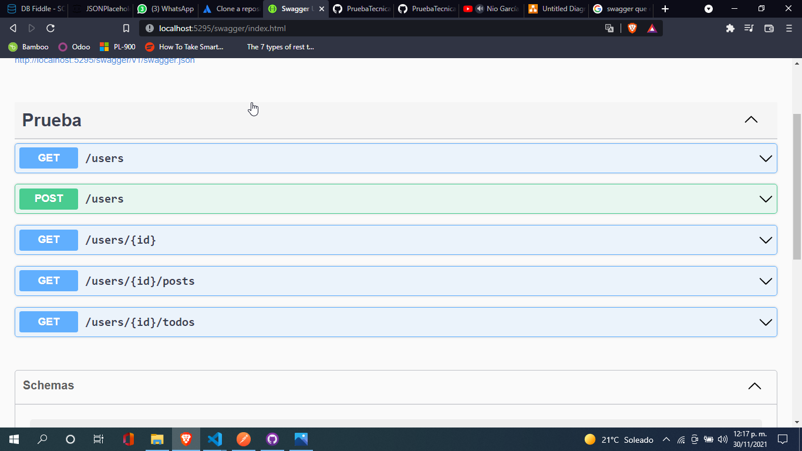

# Pruebas
Como se menciono anteriormente, se realizaron pruebas con Swagger y POSTMAN para verificar el funcionamiento de la API. A continuación, se muestran capturas de las respectivas solicitudes
## Obtener usuarios

### Peticiones en Swagger
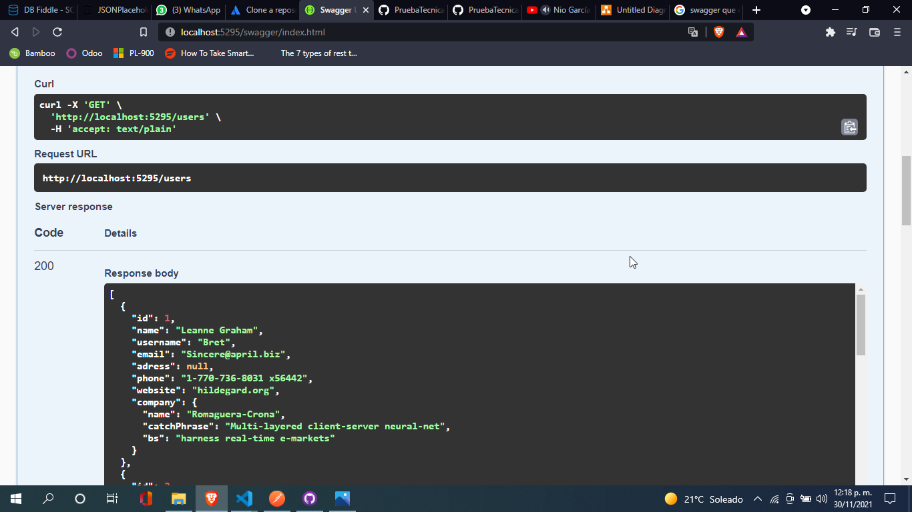
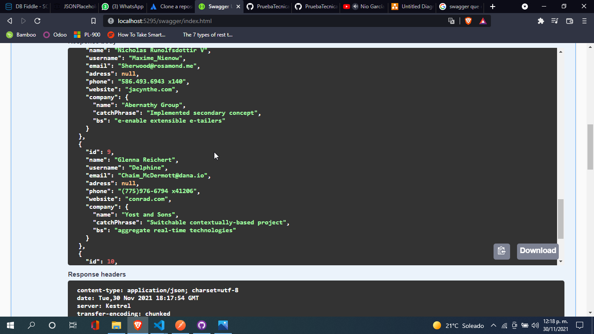

### Peticiones en POSTMAN
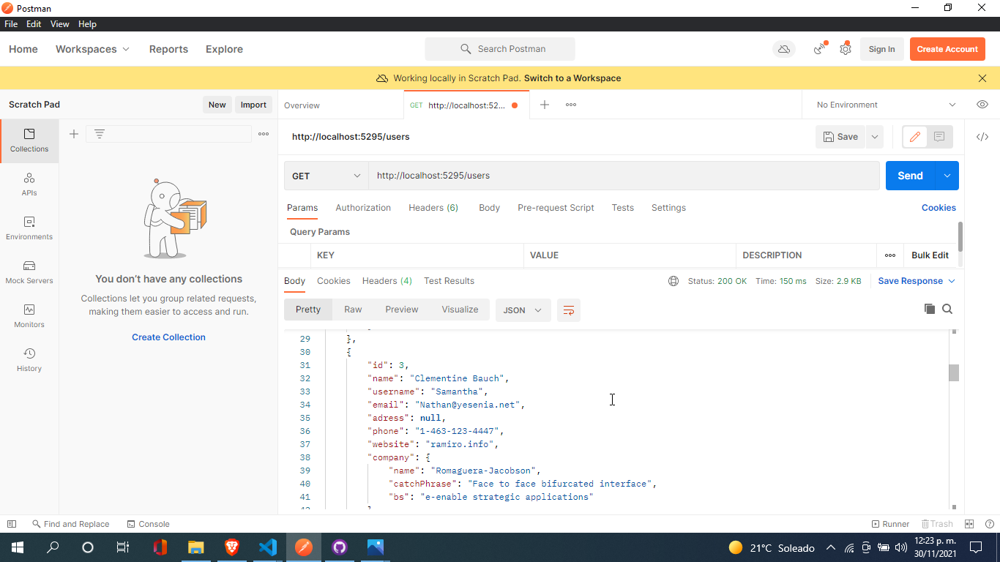

## Obtener usuario

### Peticiones en Swagger

En la siguiente imagen se realizó una petición a un usuario que no existe.
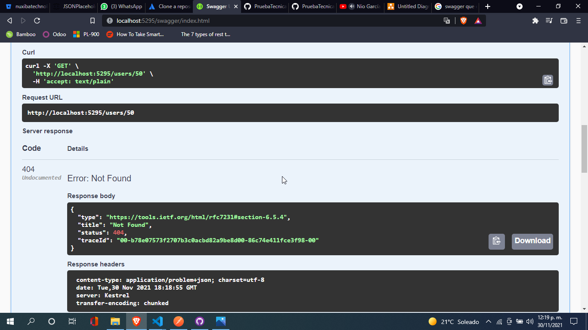

### Peticiones en POSTMAN
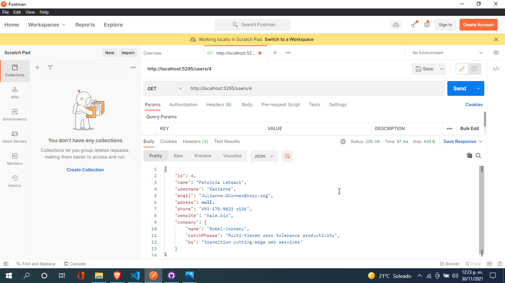

## Obtener posts

### Peticiones en Swagger

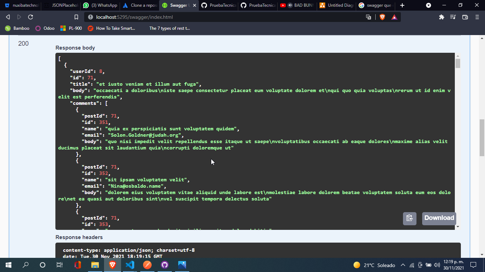
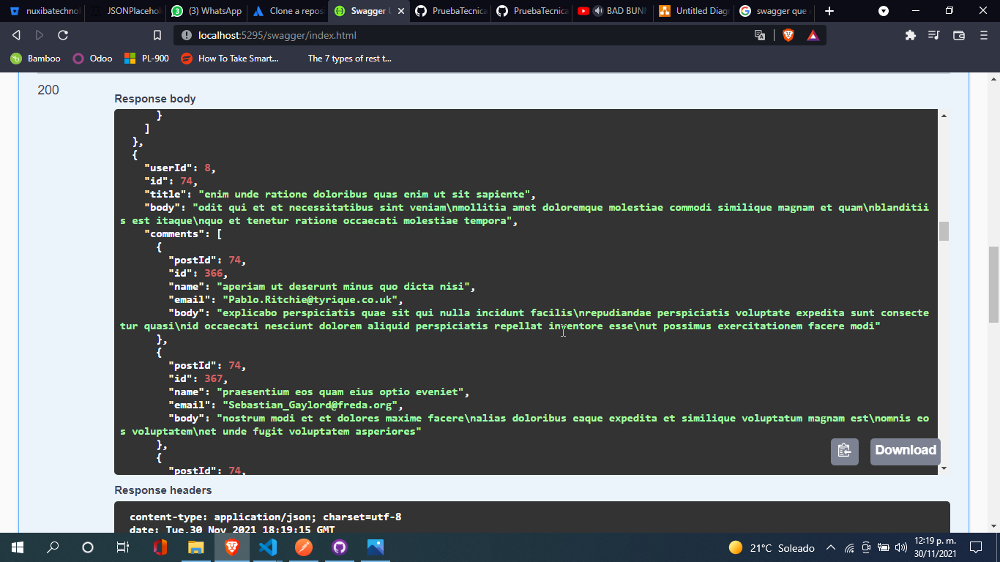

### Peticiones en POSTMAN
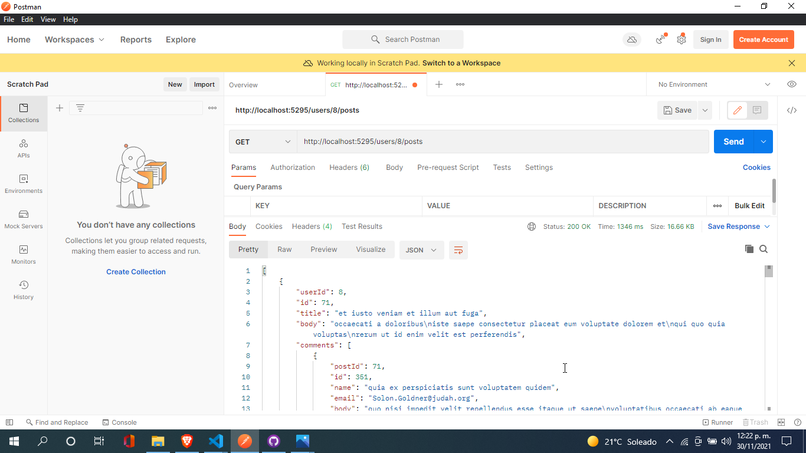
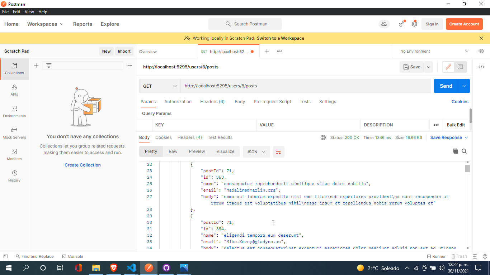

## Obtener tareas

### Peticiones en Swagger
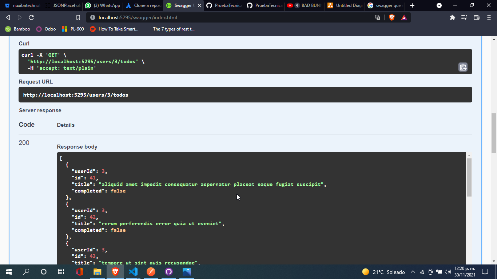
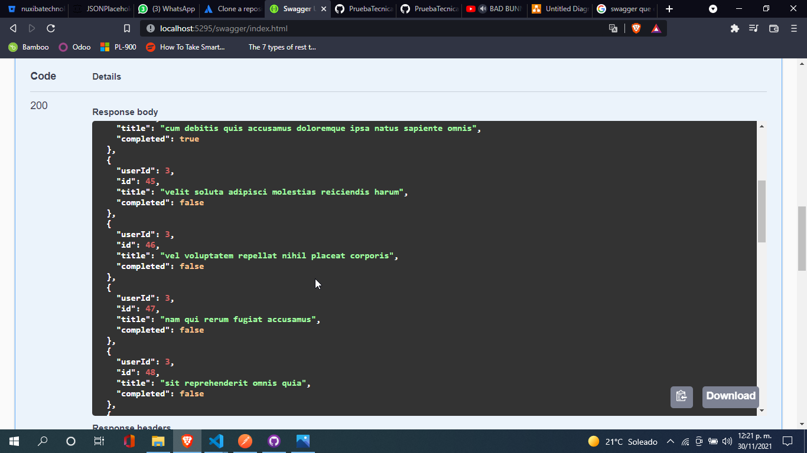

### Peticiones en POSTMAN
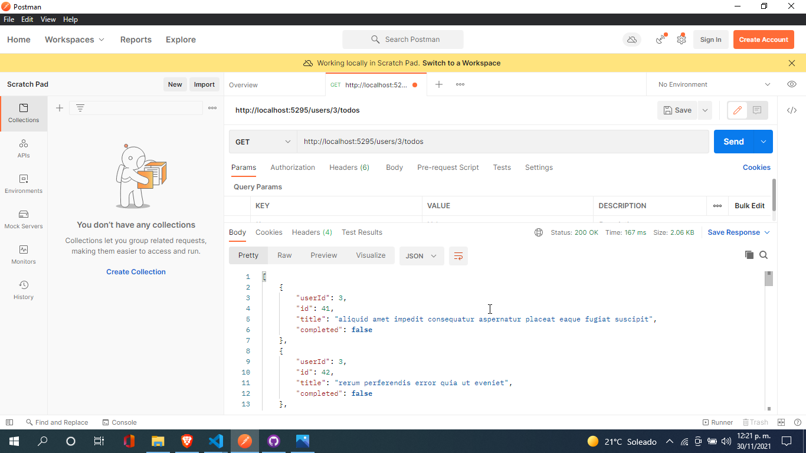
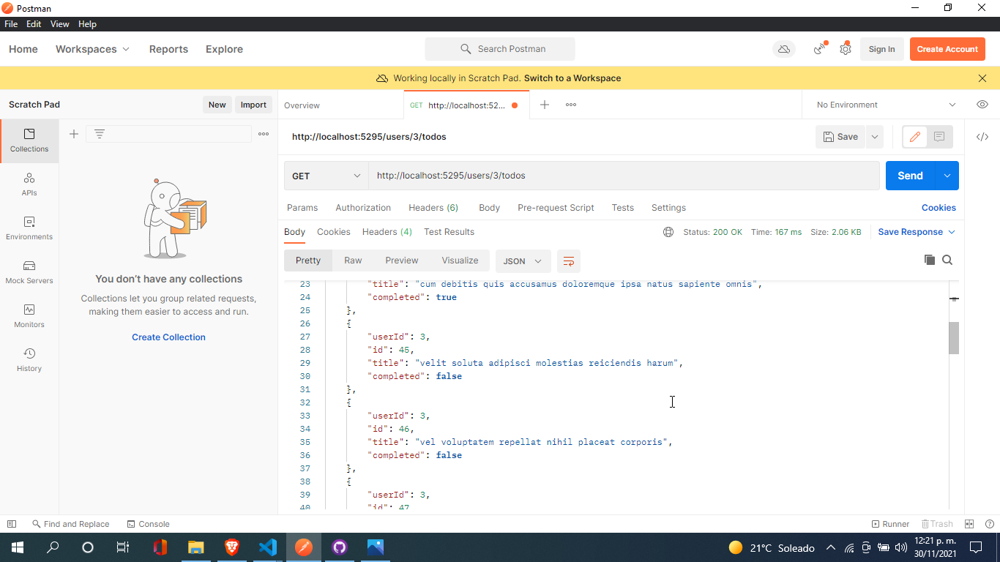

## Crear tarea

### Peticiones en Swagger
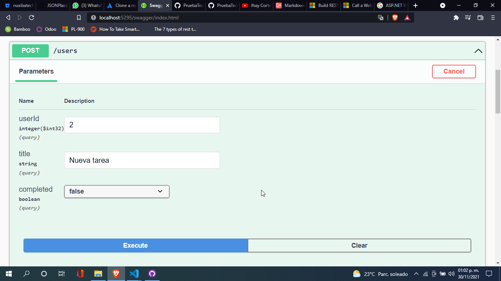
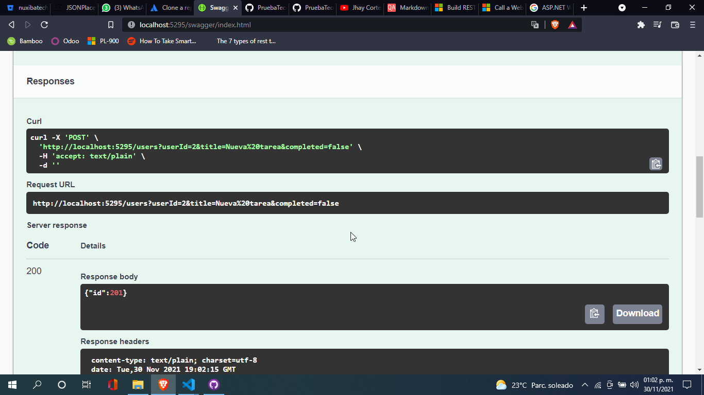

### Peticiones en POSTMAN
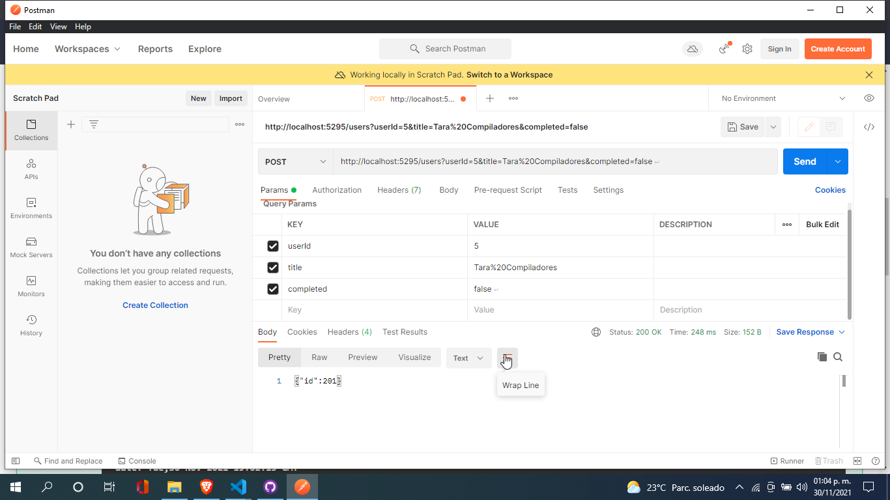
